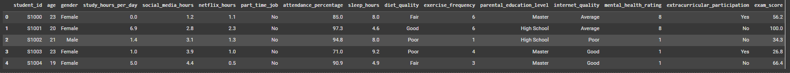

# Laporan Proyek Machine Learning - Dede Husen

## Domain Proyek
Perkembangan teknologi informasi telah membawa perubahan signifikan dalam berbagai sektor, termasuk dalam dunia pendidikan. Di era digital saat ini, data menjadi sumber daya yang sangat berharga, tidak hanya untuk dokumentasi, tetapi juga sebagai dasar pengambilan keputusan strategis. Salah satu pemanfaatan data yang krusial adalah dalam menganalisis performa akademik siswa secara menyeluruh dan objektif.

Institusi pendidikan memiliki tanggung jawab besar dalam menciptakan lingkungan belajar yang mendukung pencapaian optimal bagi setiap siswa. Studi kasus kali ini penulis akan menggunakan dataset public  dari kaggle dengan tema student habbit vs academic performance (https://www.kaggle.com/datasets/jayaantanaath/student-habits-vs-academic-performance/data) dimana capaian akademik tidak hanya dipengaruhi oleh kemampuan intelektual semata. Berbagai faktor eksternal seperti jumlah jam belajar perhari, penggunaan sosoal media, pekerjaan sampingan, waktu menonton netflix, persentase kehadiran, jam tidur, diet, tingkat pendidikan orang tua, kualitas internet, kesehatan mental hingga ekstra kurikuler,  juga memiliki kontribusi signifikan terhadap hasil belajar siswa.

**Rubrik/Kriteria Tambahan (Opsional)**:
Meningkatkan performa akademik siswa merupakan salah satu tujuan utama dari institusi pendidikan. Banyak faktor yang memengaruhi capaian akademik siswa, mulai dari aspek kognitif hingga non-kognitif. Penelitian menunjukkan bahwa waktu belajar mingguan, kehadiran, dukungan orang tua, dan keterlibatan dalam kegiatan ekstrakurikuler memainkan peran signifikan dalam memengaruhi prestasi akademik siswa.

Studi yang dilakukan oleh Dewi dan Prasetyo [1] menemukan bahwa terdapat korelasi positif antara waktu belajar dan prestasi akademik siswa. Siswa yang secara konsisten mengalokasikan waktu belajar yang cukup cenderung memiliki GPA lebih tinggi. Selain itu, absensi juga berhubungan negatif dengan performa akademik. Siswa dengan tingkat kehadiran rendah cenderung memiliki nilai yang lebih rendah [2].

Dukungan dari orang tua merupakan faktor eksternal yang signifikan. Dalam penelitian oleh Lareau [3], diketahui bahwa bentuk dukungan seperti keterlibatan dalam kegiatan sekolah, bimbingan belajar, dan perhatian terhadap pendidikan anak sangat berkontribusi pada capaian akademik. Demikian pula, keterlibatan dalam kegiatan ekstrakurikuler, seperti olahraga dan musik, dapat meningkatkan motivasi dan disiplin belajar siswa yang pada akhirnya berdampak positif pada performa akademik [4].

Namun, beberapa faktor seperti usia, jenis kelamin, dan latar belakang etnis tidak menunjukkan pengaruh yang signifikan dalam beberapa studi [5]. Oleh karena itu, fokus perlu diarahkan kepada variabel-variabel yang dapat diintervensi secara langsung untuk meningkatkan kualitas pendidikan.

Referensi
[1] R. D. Dewi and E. Prasetyo, "The Relationship between Study Time and Academic Performance among High School Students," International Journal of Educational Research, vol. 9, no. 3, pp. 125-130, 2020.

[2] J. Finn and K. Zimmer, "Student Engagement: What Is It? Why Does It Matter?," National Center for Student Engagement Journal, vol. 14, no. 1, pp. 34–50, 2012.

[3] A. Lareau, Unequal Childhoods: Class, Race, and Family Life, 2nd ed., Berkeley: University of California Press, 2011.

[4] R. Darling, "Participation in Extracurricular Activities and Adolescent Development," Journal of Leisure Research, vol. 37, no. 1, pp. 51–76, 2005.

[5] S. Sirin, "Socioeconomic Status and Academic Achievement: A Meta-Analytic Review of Research," Review of Educational Research, vol. 75, no. 3, pp. 417–453, 2005.

## Business Understanding
Berdasarkan pemaparan diatas penulis dapat menyimpulkan rincian masalah dan goals yang akan dicapai, berikut detailnya:

### Problem Statements

- Apakah jumlah jam belajar per hari secara signifikan memengaruhi nilai ujian siswa?
- Bagaimana pengaruh aktivitas di luar akademik (media sosial, Netflix, part-time job, ekstrakurikuler) terhadap performa akademik?
- Apakah faktor kesehatan (jam tidur, kualitas diet, frekuensi olahraga, rating kesehatan mental) berkaitan dengan hasil ujian?
- Apakah faktor keluarga dan lingkungan (pendidikan orang tua, kualitas internet) memengaruhi nilai siswa?
- Bisakah kita membangun model prediksi nilai ujian berdasarkan kombinasi dari semua kebiasaan siswa?

## Goals

Tujuan utama dari proyek ini adalah untuk menganalisis dan memprediksi faktor-faktor yang memengaruhi performa akademik siswa berdasarkan data kebiasaan harian, kondisi kesehatan, dan latar belakang mereka. Secara lebih rinci, tujuan dari pernyataan masalah ini adalah sebagai berikut:

- Mengidentifikasi variabel-variabel penting yang memiliki korelasi signifikan terhadap nilai ujian siswa (exam_score), seperti jam belajar, penggunaan media sosial, kualitas tidur, dan lainnya.

- Mengevaluasi pengaruh aktivitas non-akademik (seperti menonton Netflix, penggunaan media sosial, dan pekerjaan paruh waktu) terhadap pencapaian akademik.

- Menganalisis peran faktor kesehatan dan kesejahteraan (jam tidur, kualitas diet, olahraga, dan kesehatan mental) dalam mendukung kinerja akademik siswa.

- Membangun model prediktif menggunakan algoritma machine learning (seperti regresi linier atau random forest) untuk memprediksi nilai ujian siswa berdasarkan kombinasi berbagai variabel.

- Memberikan wawasan dan rekomendasi berbasis data untuk siswa, pendidik, atau orang tua dalam mengelola kebiasaan dan lingkungan belajar yang optimal guna meningkatkan performa akademik.

**Rubrik/Kriteria Tambahan (Opsional)**:
### Solution statements
- Untuk menjawab pernyataan masalah dan mencapai tujuan yang telah dirumuskan, solusi yang diusulkan dalam proyek ini mencakup langkah-langkah berikut:

### Pra-pemrosesan Data
Membersihkan dan menyiapkan data, termasuk penanganan nilai kategorik, normalisasi/standarisasi data numerik, dan penanganan nilai yang hilang (jika ada), agar siap digunakan dalam pelatihan model machine learning.

### Eksplorasi Data dan Analisis Statistik
- Melakukan eksplorasi data (EDA) untuk memahami distribusi data, mengidentifikasi korelasi antara fitur dengan nilai ujian, serta menemukan pola atau anomali yang signifikan.

### Pemilihan dan Pengujian Model Prediktif
- Membangun beberapa model regresi prediktif seperti:
- Linear Regression
- Decision Tree Regressor
- Random Forest Regressor
untuk memperkirakan nilai ujian siswa berdasarkan fitur-fitur yang tersedia.

### Evaluasi Model
- Mengevaluasi performa model menggunakan metrik seperti Mean Absolute Error (MAE), Root Mean Squared Error (RMSE), dan R² Score untuk memilih model terbaik yang paling akurat dalam memprediksi nilai ujian.

### Interpretasi dan Penyajian Hasil
- Menginterpretasikan hasil model, mengidentifikasi fitur yang paling berpengaruh terhadap performa akademik, serta menyajikan visualisasi hasil dan rekomendasi berbasis data untuk perbaikan kebiasaan belajar siswa.

## Data Understanding
Data student Habits vs Academic Performance diambil dari platform kaggle (<https://www.kaggle.com/datasets/jayaantanaath/student-habits-vs-academic-performance/data>) dimana dataset ini  berisi 1000 baris baris data unik dengan 16 kolom didalamnya. Dataset ini merupakan simulasi yang dirancang untuk mengeksplorasi keterkaitan antara kebiasaan gaya hidup dan kinerja akademik siswa. dataset ini dapat dijadikan bahan latihan dalam mengekplorasi pengaruh aktifitas siswa terhadap keberhasilan akademik disekolah

Selanjutnya uraikanlah seluruh variabel atau fitur pada data. Sebagai contoh:  

### Variabel-variabel pada Restaurant UCI dataset adalah sebagai berikut:
| **Kolom**                       | **Deskripsi**                                                                                                                               |
| ------------------------------- | ------------------------------------------------------------------------------------------------------------------------------------------- |
| `student_id` | ID unik untuk masing-masing siswa. Tidak bersifat prediktif, hanya untuk identifikasi.                                                                         |
| `age`                           | Usia siswa dalam tahun. Bertipe numerik dan dapat digunakan untuk analisis demografis.                                                      |
| `gender`                        | Jenis kelamin siswa. Bertipe kategorikal (misalnya: "Male", "Female"). Perlu encoding.                                                      |
| `study_hours_per_day`           | Jumlah rata-rata jam belajar per hari. Fitur numerik penting dalam memprediksi performa.                                                    |
| `social_media_hours`            | Rata-rata jam yang dihabiskan menggunakan media sosial per hari. Fitur ini dapat menunjukkan pengaruh distraksi terhadap performa akademik. |
| `netflix_hours`                 | Rata-rata jam menonton Netflix per hari. Dapat berperan sebagai indikator aktivitas hiburan/non-akademik.                                   |
| `part_time_job`                 | Status pekerjaan paruh waktu (misalnya: "Yes"/"No"). Fitur kategorikal biner.                                                               |
| `attendance_percentage`         | Persentase kehadiran siswa. Semakin tinggi, umumnya berkorelasi positif dengan performa.                                                    |
| `sleep_hours`                   | Rata-rata jam tidur siswa per hari. Berperan dalam analisis keseimbangan gaya hidup.                                                        |
| `diet_quality`                  | Kualitas pola makan (misalnya: "Poor", "Average", "Good"). Termasuk kategorikal ordinal.                                                    |
| `exercise_frequency`            | Frekuensi berolahraga per minggu. Fitur numerik yang dapat dikaitkan dengan kesehatan fisik/mental.                                         |
| `parental_education_level`      | Tingkat pendidikan orang tua. Fitur kategorikal yang mungkin memengaruhi motivasi/dukungan belajar.                                         |
| `internet_quality`              | Kualitas akses internet di rumah siswa (misalnya: "Poor", "Average", "Good"). Penting untuk pembelajaran daring.                            |
| `mental_health_rating`          | Penilaian subjektif siswa terhadap kondisi mental mereka, biasanya dalam skala numerik (misal 1–10).                                        |
| `extracurricular_participation` | Partisipasi dalam kegiatan ekstrakurikuler (misalnya: "Yes"/"No"). Bisa berdampak positif atau negatif tergantung konteks.                  |
| `exam_score`                    | Skor ujian akhir siswa. Ini adalah **target variabel utama** untuk prediksi performa akademik.                                              |

***Rubrik/Kriteria Tambahan (Opsional):***

- Melakukan beberapa tahapan yang diperlukan untuk memahami data, contohnya teknik visualisasi data atau exploratory data analysis.

### Exploratory Data Analysis (EDA) - Student Performance Dataset

#### 1. Distribusi Nilai Ujian
Distribusi nilai ujian menunjukkan pola yang mendekati normal, dengan mayoritas nilai berada di kisaran **65–80**.

#### 2. Korelasi antar Fitur Numerik
Heatmap menunjukkan:
- Korelasi **positif** terhadap `exam_score`:
  - `study_hours_per_day`
  - `attendance_percentage`
  - `sleep_hours` (moderat)
- Korelasi **negatif** terhadap `exam_score`:
  - `social_media_hours`
  - `netflix_hours`

#### 3. Gender vs Exam Score

Tidak ada perbedaan signifikan antara nilai ujian laki-laki dan perempuan.

#### 4. Jam Belajar vs Nilai Ujian
Terdapat tren **positif** yang menunjukkan bahwa semakin banyak jam belajar per hari, semakin tinggi nilai ujian.

#### 5. Kehadiran vs Nilai Ujian
Korelasi positif terlihat antara tingkat kehadiran dan nilai ujian, menunjukkan bahwa siswa yang lebih sering hadir cenderung mendapat nilai lebih baik.

#### 6. Pendidikan Orang Tua vs Nilai Ujian
Siswa dengan orang tua berpendidikan tinggi (misalnya S1/S2) cenderung memiliki nilai ujian yang lebih tinggi, meskipun terdapat variasi.

#### 6. Distribusi Fitur Numerik
- Berikut distibusi Fitur numerik pada data frame ini 

#### 6. Distribusi Fitur Kategorikal
Berikut distribusi fitur kategorikal

#### 7 Heatmap Korelasi antar fitur 

terlihat diatas, bahwa korelasi paling tinggi ada di studi time perharinya

### Kesimpulan Awal

Beberapa variabel penting yang mungkin berpengaruh signifikan terhadap nilai ujian:

- Jam belajar per hari
- Persentase kehadiran
- Jam tidur
- Kualitas aktivitas sosial (media sosial dan Netflix)
- Pendidikan orang tua

## Data Preparation
Pada bagian ini Anda menerapkan dan menyebutkan teknik data preparation yang dilakukan. Teknik yang digunakan pada notebook dan laporan harus berurutan.
### Memahami Struktur Data
  - Menggunakan fungsi df.info() | df.describe() untuk melihat ringkasan data dalam bentuk statistik dan distribusi awal
  
  
  

### Menangani Missing Values
- Kolom parental_education_level memiliki 91 nilai kosong.
- Teknik yang diterapkan: imputasi dengan modus (mode) 

### Menghapus Kolom yang Tidak Digunakan
- Kolom student_id dihapus karena tidak relevan dalam prediksi.

### Encoding Variabel Kategorik
- Mengubah variabel kategorikal menjadi numerik agar bisa diproses oleh model machine learning.
- Mengunakan one-hot encoding atau label encoding sesuai kebutuhan.

### Pemisahan Fitur dan Target
- Memisahkan kolom fitur (X) dan target prediksi (y = exam_score).

### Split Data untuk Pelatihan dan Pengujian
- Memisahkan data menjadi training dan testing set (contoh: 80:20 split).

## Modeling
- Dalam proyek ini, dua algoritma regresi digunakan untuk memprediksi nilai ujian (exam_score) berdasarkan kebiasaan belajar dan gaya hidup siswa, yaitu Linear Regression dan Random Forest Regressor. Keduanya memiliki karakteristik dan performa yang berbeda, serta keunggulan masing-masing.

### Regresi Linier

- Linear Regression adalah algoritma regresi yang paling sederhana dan mudah diinterpretasikan. Model ini bekerja dengan mengasumsikan adanya hubungan linear antara fitur-fitur masukan dengan target output. Keunggulan utama Linear Regression adalah efisiensinya dalam komputasi dan kemudahannya dalam interpretasi hasil. Misalnya, koefisien dari setiap fitur dapat memberikan informasi langsung tentang pengaruh fitur tersebut terhadap nilai ujian.
Namun, kelemahan utama dari Linear Regression adalah ketidakmampuannya dalam menangani hubungan non-linear dalam data. Model ini juga sangat sensitif terhadap outlier dan multikolinearitas antar fitur. Dalam konteks data ini, pola hubungan antara kebiasaan siswa dan nilai ujian tampaknya cukup kompleks dan tidak sepenuhnya linear, sehingga performa Linear Regression menjadi kurang optimal.

### Random Fores Regressor
- Random Forest Regressor adalah algoritma ensemble berbasis decision tree yang mampu menangani hubungan non-linear dan interaksi antar fitur secara lebih baik. Model ini bekerja dengan membangun banyak pohon keputusan (trees) dan menggabungkan prediksinya untuk menghasilkan output yang lebih stabil dan akurat. Random Forest juga lebih tahan terhadap overfitting dibandingkan decision tree tunggal karena melakukan averaging dari banyak pohon.

Proses Hyperparameter Tuning dengan GridSearchCV
Untuk meningkatkan performa model Random Forest Regressor, dilakukan proses hyperparameter tuning menggunakan teknik Grid Search dengan validasi silang (cross-validation). Tujuan dari tahap ini adalah untuk menemukan kombinasi parameter terbaik yang menghasilkan performa prediksi paling akurat terhadap data.

-Parameter yang diuji dalam proses tuning adalah sebagai berikut:
n_estimators: Merupakan jumlah pohon keputusan (decision trees) yang akan dibuat dalam Random Forest. Semakin banyak pohon, biasanya model akan lebih stabil, tetapi juga membutuhkan waktu komputasi yang lebih lama. Dalam tuning ini, diuji tiga nilai: 50, 100, dan 150.
max_depth: Menentukan kedalaman maksimum dari setiap pohon dalam hutan. Kedalaman yang terlalu rendah dapat menyebabkan model underfitting, sementara kedalaman yang terlalu tinggi bisa menyebabkan overfitting. Nilai yang diuji dalam tuning ini adalah 5, 10, dan 20.
Kombinasi dari kedua parameter tersebut diuji menggunakan GridSearchCV, yaitu metode pencarian yang secara sistematis mencoba semua kemungkinan kombinasi parameter yang telah ditentukan. Proses tuning ini juga menggunakan 5-fold cross-validation, di mana data latih dibagi menjadi lima bagian, dan model dilatih dan divalidasi sebanyak lima kali secara bergiliran. Hal ini dilakukan untuk memastikan bahwa hasil evaluasi model tidak tergantung pada satu subset data saja.
Metode evaluasi yang digunakan dalam proses ini adalah Mean Squared Error (MSE), namun dalam implementasi GridSearchCV, metrik ini dikalikan dengan -1 (neg_mean_squared_error) karena scikit-learn mengharuskan nilai skor evaluasi semakin besar semakin baik.
Setelah semua kombinasi parameter diuji, GridSearchCV akan memilih model dengan kombinasi parameter terbaik berdasarkan nilai MSE terkecil. Model ini kemudian digunakan sebagai model final untuk melakukan prediksi terhadap data uji.
Dengan menggunakan teknik ini, model Random Forest Regressor yang dihasilkan menjadi lebih optimal, memiliki generalisasi yang lebih baik terhadap data baru, dan mengurangi risiko overfitting atau underfitting.

- Dalam eksperimen yang dilakukan, Random Forest Regressor menunjukkan performa yang lebih baik dibandingkan Linear Regression, ditandai dengan nilai MAE dan RMSE yang lebih rendah serta R² score yang lebih tinggi, yang menunjukkan bahwa model ini mampu menjelaskan variasi data target dengan lebih baik.

## Evaluation

#  Evaluasi Model dan Interpretasi Hasil

# 📊 Evaluasi Model dan Interpretasi Hasil

Dalam proyek ini, tujuan utama adalah memprediksi **nilai ujian siswa (`exam_score`)** berdasarkan berbagai kebiasaan harian dan gaya hidup. Karena target yang diprediksi bersifat **numerik kontinu**, maka proyek ini dikategorikan sebagai **masalah regresi**, dan metrik evaluasi yang digunakan pun disesuaikan.

---

## ✅ Metrik Evaluasi yang Digunakan

Tiga metrik utama yang digunakan untuk mengevaluasi performa model regresi adalah:

### 1. Mean Absolute Error (MAE)
- Mengukur rata-rata kesalahan absolut antara nilai aktual dan prediksi.
- Rumus:

- Semakin kecil nilainya, semakin baik model memprediksi.

### 2. Root Mean Squared Error (RMSE)
- Mengukur akar dari rata-rata kuadrat kesalahan.
- Lebih sensitif terhadap outlier dibanding MAE.
- Rumus:
  

### 3. R-squared (R²)
- Menjelaskan seberapa besar variansi dari target bisa dijelaskan oleh fitur.
- Rumus:
 
 
- Nilai mendekati 1 menunjukkan model sangat baik.

---

## 📈 Hasil Evaluasi Model

Setelah dilakukan pelatihan dan evaluasi menggunakan **Linear Regression** dan **Random Forest Regressor**, berikut hasilnya pada data uji:

| Model                   | MAE   | RMSE  | R² Score |
|------------------------|--------|--------|----------|
| Linear Regression      | 4.19   | 5.15   | 0.897    |
| Random Forest Regressor| 4.97   | 6.21   | 0.850    |

---

## 🏁 Kesimpulan Evaluasi

- **Linear Regression memberikan hasil prediksi yang lebih akurat** dibandingkan Random Forest Regressor berdasarkan seluruh metrik evaluasi.
  - MAE dan RMSE Linear Regression lebih rendah → prediksi rata-rata lebih dekat ke nilai aktual.
  - R² Linear Regression sebesar **0.897** menunjukkan bahwa model mampu menjelaskan hampir 90% variabilitas dari nilai ujian siswa.
- **Random Forest Regressor**, meskipun dikenal kuat terhadap non-linearitas dan outlier, dalam kasus ini menunjukkan performa yang sedikit lebih rendah dibanding model linier.
- Berdasarkan evaluasi, **Linear Regression dipilih sebagai model terbaik** untuk proyek ini.

**---Ini adalah bagian akhir laporan---**

_Catatan:_
- _Anda dapat menambahkan gambar, kode, atau tabel ke dalam laporan jika diperlukan. Temukan caranya pada contoh dokumen markdown di situs editor [Dillinger](https://dillinger.io/), [Github Guides: Mastering markdown](https://guides.github.com/features/mastering-markdown/), atau sumber lain di internet. Semangat!_
- Jika terdapat penjelasan yang harus menyertakan code snippet, tuliskan dengan sewajarnya. Tidak perlu menuliskan keseluruhan kode project, cukup bagian yang ingin dijelaskan saja.

